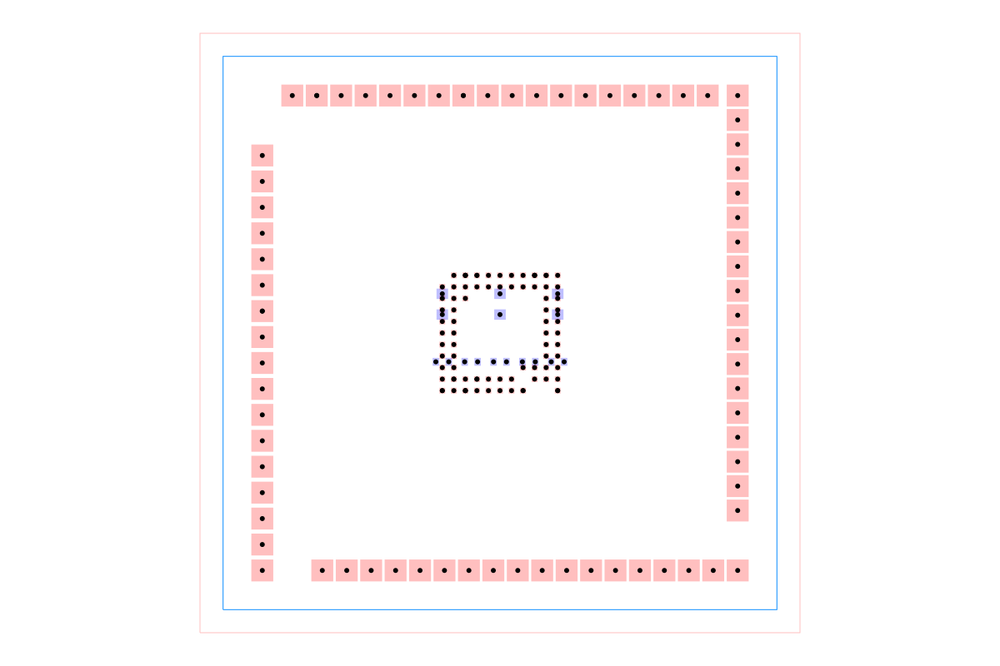

# dataset-srj22

Four dense autorouting problems used by the `autorouting-dataset-runner`
benchmark CLI. The checked-in Simple Route JSON samples each contain 158
obstacles, 87 or 91 connections, and both two- and four-layer variants. The
package also includes dataset validation, random-circuit generation, benchmark
reporting, and HTML result visualization utilities.

## Example

The image below shows `circuit002`. It is generated by constructing an
`AutoroutingPipelineSolver`, calling `.visualize()`, and converting the
graphics object to SVG with `graphics-debug`.

Regenerate it with `bun run generate:readme-image`.

## Browse and deploy

Run `bun run cosmos` for the React Cosmos catalog. `bun run build:site` exports
it to `cosmos-export/`, the output directory configured for Vercel.
